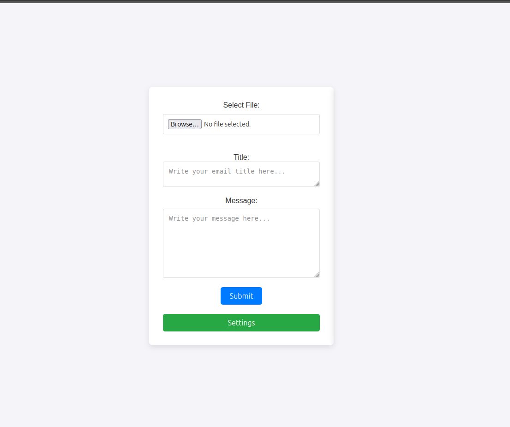

# Email Automation Tool

**Email Automation Tool** is a lightweight browser extension designed to simplify repetitive email tasks. Easily send personalized emails to multiple recipients by importing an Excel file containing their information and automating the entire process.

## Features

- Import an Excel file containing recipient emails and related data.
- Compose custom messages with placeholders for dynamic content.
- Send emails effortlessly with a few clicks.
- Securely use your Gmail account with an app password.
- Simple and intuitive interface.

---

## How It Works

1. **Prepare Your Data**  
   Create an Excel file with columns for recipient emails and dynamic fields (e.g., Name, Email, Message Content).  
   Example:  

   | Name   | Email              | Content           |  
   |--------|--------------------|-------------------|  
   | John   | john@example.com   | Welcome message!  |  
   | Jane   | jane@example.com   | Thank you email!  |

2. **Upload the File**  
   Upload the Excel file through the extension. The tool will process and display the data.

3. **Compose the Message**  
   Write your email, using placeholders (e.g., `{Name}`, `{Content}`) to insert personalized data from the Excel file.

4. **Send Emails**  
   Click "Send" to deliver emails to all recipients in the list.

---

## Prerequisites

- A Gmail account.
- An [app password](https://support.google.com/accounts/answer/185833?hl=en) for Gmail.
- A browser supporting extensions (e.g., Chrome).

---

## Screenshots

### User Interface  

### Settings 

---
